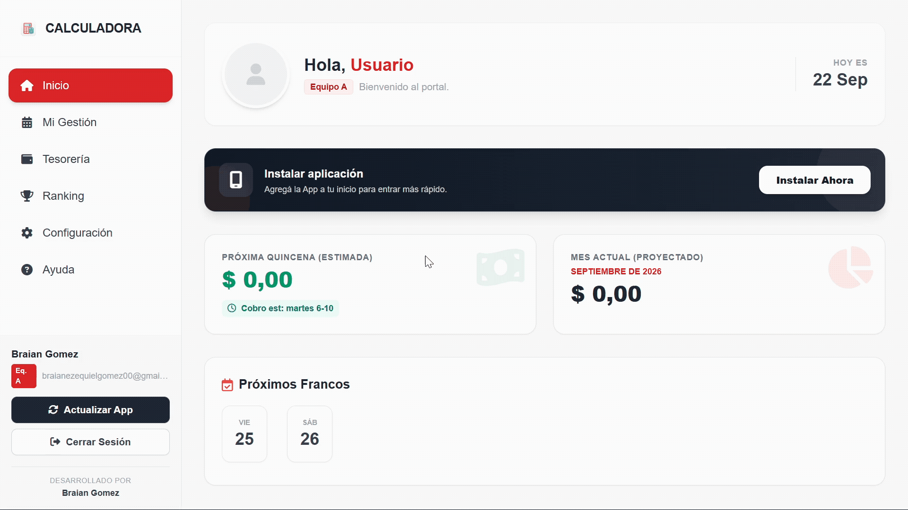

  

 

# 🏭 Portal del Empleado - Calculadora Salarial PWA

**[ HERRAMIENTA OPERATIVA EN PRODUCCIÓN | B2B INDUSTRIAL ]**

🔗 **Ver en vivo:** [Visitar la aplicación activa](https://calculadora-salarial-6x2.vercel.app/)

Aplicación Web Progresiva (PWA) diseñada para resolver la complejidad administrativa y financiera del esquema de turnos rotativos continuos (6x2) en el sector industrial. Desarrollada inicialmente para el personal de **Papelera Rosato S.A.**, la plataforma automatiza la liquidación de sueldos, elimina la fricción del cálculo manual y transparenta las proyecciones salariales para el trabajador.

## 🚀 Arquitectura y Lógica de Negocio

* **Motor de Rotación Algorítmica (6x2):** Calcula automáticamente el ciclo de turnos (Mañana, Tarde, Noche) y francos en un calendario infinito, basándose en un "seed" o fecha de inicio configurada por el usuario.
* **Proyección Financiera Quincenal:** Motor lógico que estima el salario bruto y neto dividiendo los períodos en 1ra y 2da quincena. Aplica deducciones sindicales, cálculo de viáticos, bonos por título y métricas de presentismo.
* **Gestión de Variables Críticas:** Interfaz para la imputación precisa de horas extras (diferenciando valoraciones de días normales vs. feriados), ausencias, y penalizaciones por llegadas tarde.
* **Sincronización Cloud & Modo Efímero:** Autenticación fluida mediante Google y persistencia de datos en Firebase Firestore. Incluye un "Modo Invitado" para simulaciones rápidas sin registro.
* **Generación de Reportes:** Exportación del historial financiero a documentos PDF detallados utilizando `jsPDF`, generando comprobantes listos para el control personal o auditoría.
* **Optimización de Storage:** Compresión algorítmica de fotos de perfil mediante Canvas API y codificación Base64 en el cliente, almacenando las imágenes directamente en la base de datos para minimizar costos de infraestructura.

## 🛠️ Stack Tecnológico

* **Frontend:** Vanilla JavaScript (ES Modules), HTML5 semántico.
* **Diseño UI/UX:** Tailwind CSS (Sistema de diseño responsivo y optimizado para PWA).
* **Backend as a Service (BaaS):** Firebase (Authentication, Cloud Firestore).
* **Procesamiento Documental:** `jsPDF` & `jsPDF-AutoTable` (Generación de reportes PDF del lado del cliente).
